class: title-slide
background-image: url(images/logo_uqam.png), url(images/background.jpg)
background-size: 20%, cover
background-position: 95% 95%, center

.titre-page-titre[Modélisation des sinistres en assurance automobile avec l'utilisation de données télématiques : Approches d'apprentissage automatique en classification et régression de comptage]
<br />
.sous-titre-page-titre[Soutenance de thèse]
<br />
***
<br />
.sous-sous-titre-page-titre[.mon-style-bleu[par] Francis Duval <br> .mon-style-bleu[le] 26 février 2024]

???

- Bonjour tout le monde! Tout d'abord, merci d'être venus assister à ma soutenance de thèse.
- Ma thèse s'intitule « Modélisation des sinistres en assurance automobile avec l'utilisation de données télématiques : Approches d'apprentissage automatique en classification et régression de comptage ».

---

# Contenu
<br>
.left[
  .bleu-gros[1) Introduction] <br> <br> <br>
  .bleu-gros[2) Chapitre 1] <br> **How Much Telematics Information Do Insurers Need for Claim Classification?** <br> <br>
  .bleu-gros[3) Chapitre 2] <br> **Enhancing Claim Classification with Feature Extraction From Anomaly-Detection-Derived Routine and Peculiarity Profiles** <br> <br>
  .bleu-gros[4) Chapitre 3] <br> **Telematics Combined Actuarial Neural Networks for Cross-Sectional and Longitudinal Claim Count Data** <br> <br>
  .bleu-gros[5) Conclusion]
]

???

- Voici un aperçu du contenu de la présentation.
- Dans la Section 1, l'introduction, je vais vous présenter quelques principes de base qui ont servi de piliers dans ma recherche. Je vais aussi vous présenter les données sur lesquelles j'ai travaillé.
- C'est une thèse par articles, c'est-à-dire qu'elle consiste en 3 articles distincts. Aux Sections 2, 3 et 4, je vous présente chacun de ces 3 articles.
- Finalement, on conclut à la Section 5.

---

# Introduction

## Assurance basée sur l'usage

- Tarification en assurance automobile traditionellement faite avec un ensemble limité de **caractéristiques du risque**.
- Avec l'avènement de la technologie **télématique**, possibilité de collecter des données sur la conduite des assurés.

.center[
```{r echo = F, out.width = "4%", fig.align = "center"}
knitr::include_graphics("images/sep_car.png")
```
]
.titre-bloc.bleu[
De nombreux bénéfices!
]
.bloc.titre.bleu[
- Incitatif pour une conduite plus parcimonieuse et sécuritaire.
  - Amélioration de la sécurité des routes.
  - Réduction des gaz à effet de serre.
- Tarification plus précise et équitable basée sur le comportement de conduite réel de chaque individu.
- Substituts à des attributs considérés éthiquement sensibles tels que le genre.
]

???

- Ma thèse vise à améliorer la modélisation des sinistres en assurance automobile, plus précisément en assurance basée sur l'usage.
- L'assurance basée sur l'usage est un modèle d'assurance où les primes sont calculées en fonction de données collectées sur l'assuré.
- En assurance automobile, ces données, qu'on appelle « données télématiques », sont collectées à l'aide d'un dispositif installé dans le véhicule ou d'une application mobile.
- Ces données peuvent inclure la distance parcourue par l'assuré, les heures de conduite, la localisation, les freinages brusques, et bien d'autres encore.
- Traditionnellement, la tarification est faite en ne regardant pas l'utilisation du véhicule. On tarifie avec un ensemble de caratéristiques du risque comme l'âge et le genre de l'assuré, l'âge du véhicule, la région et plusieurs autres.

- Tarifer selon l'utilisation offre de nombreux avantages pour tout le monde. 
- Avant tout, ça constitue un incitatif à mieux et à moins conduire pour les assurés, ce qui permet d'améliorer la sécurité des routes et de diminuer la pollution. Donc on a une diminution de l'aléa moral, un effet qui est omniprésent en assurance.
- Pour un assureur, ça permet de mieux segmenter la prime, et donc d'aller chercher un avantage compétitif.
- Les données télématiques peuvent également servir de substitus à des attributs sensibles ou des attributs qui sont interdits d'utilisation par la loi. Par exemple, dans certaines juridictions, on ne peut pas tarifer selon le genre de l'assuré.
- Je n'ai pas parlé des inconvénients ici, mais c'est certain qu'utilisées de manière intelligente et responsable, les bénéfices qu'on peut tirer des données télématiques surpassent les inconvénients, et c'est pour ça que c'est important de faire de la recherche là-dessus.   

---

background-image: url(images/machine_learning_picto.png)
background-size: 10%
background-position: 95% 20%

$$\DeclareMathOperator*{\argmin}{argmin}$$
.vspace-neg[]

# Introduction

## Apprentissage supervisé &#x2014; Idée générale

.vspace-neg2[]

- Requiert un ensemble d'**exemples étiquetés**
\begin{align*}
  \{(\boldsymbol{x}_i, y_i)\}_{i=1}^n, \quad \text{où}\quad \boldsymbol{x}_i \in \mathcal{X},\quad y \in \mathcal{Y}
\end{align*}

???

- Le principal outil utilisé dans la thèse est l'apprentissage supervisé.
- Pour être entrainé, un algorithme d'apprentissage supervisé requiert un jeu de données d'exemples étiquetés.
- Donc pour chaque exemple i, on a un vecteur de prédicteurs x qui est associé à une étiquette, ou variable réponse y.
- Par exemple, la variable d'intérêt y pourrait être le coût de réclamation et x, un vecteur de caractéristiques du risque.

--

- But: modéliser la **variable réponse** $y$ à l'aide des **prédicteurs** $\boldsymbol{x}$. On cherche une fonction $h: \mathcal{X} \rightarrow \mathcal{A}$, où $\mathcal{A}$ est l'ensemble des prédictions possibles, telle que $h(\boldsymbol{x})$ est la plus « proche » possible de $y$.

???

- y, c'est notre variable d'intérêt qu'on veut modéliser avec l'aide de notre vecteur x.
- Donc en fait, on cherche une fonction de x qui va nous donner une valeur la plus proche possible de y.

--

- Pour définir « proche », on introduit une **fonction de perte** $\ell: \mathcal{A} \times \mathcal{Y} \rightarrow \mathbb{R}^+$.
- $\ell[h(\boldsymbol{x}), y]$ mesure la « distance » entre la prédiction $h(\boldsymbol{x})$ et la réponse $y$.

???

- Pour définir « proche », on introduit une fonction de perte $\ell$ qui va pour but de mesurer la « distance » entre la prédiction h(x) et la réponse y.

--

- Pour trouver une bonne fonction $h^*$, on va (essayer de) minimiser le **risque empirique**, c'est-à-dire la perte moyenne sur l'ensemble d'exemples:
\begin{align*}
  h^* = \argmin_{h} \frac{1}{n}\sum_{i=1}^n \ell[h(\boldsymbol{x}_i), y_i]. 
\end{align*}

???

- Et ensuite, pour trouver notre fonction h, on va habituellement essayer de minimiser ce qu'on appelle le « risque empirique » sur nos exemples d'entrainement.
- Le risque empirique, c'est simplement la somme (ou la moyenne) de la fonction de perte évaluée sur chacun des exemples.

--

- Plusieurs algorithmes d'apprentissage supervisés ont été développés pour résoudre ce problème d'optimisation (GLMs, arbres de décision, forêts aléatoires, boosting, réseaux de neurones, régularisation, etc.).

???

- Pour trouver une bonne fonction h, plusieurs algorithmes ont été développés.
- Ces algorithmes d'apprentissage nous définissent en fait un espace de recherche pour la fonction h ainsi qu'une recette pour trouver la fonction optimale (ou une bonne fonction) dans cet espace.

---

# Introduction

## Apprentissage supervisé &#8212; Compromis biais-variance

**Décomposition de l'erreur**
\begin{align*}
  \text{Erreur} = \text{Biais}^2 + \text{Variance} + \text{Erreur irréductible}
\end{align*}

```{r echo = F, out.width = "90%", fig.align = "center"}
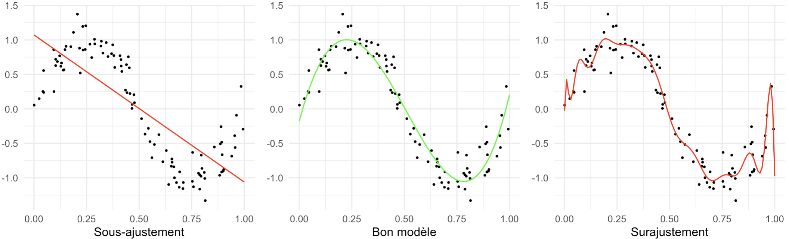
```

- Le compromis biais-variance dit que l'on peut « troquer » du biais contre de la variance, et vice-versa.

???

- Un concept très important en apprentissage supervisé est le compromis biais-variance, qui est intimement lié aux concepts de sous-ajustement et surajustement.
- Donc tout d'abord, on peut décomposer l'erreur en 3 parties: le biais au carré, la variance et l'erreur irréductible.
- L'erreur irréductible, c'est l'erreur qu'on ferait même si on avait le meilleur modèle possible, c'est-à-dire si on savait la fonction qui a généré les données. On a pas de contrôle là-dessus.
- Par contre, on a le contrôle sur le biais et la variance, et donc si on veut diminuer l'erreur, on peut diminuer un des 2.
- Et ce que le compromis biais-variance dit en fait, c'est que si l'un augmente, alors l'autre va systématiquement diminuer, et vice-versa.
- L'idée en apprentissage supervisé est de trouver un bon compromis, c'est-à-dire un compromis qui va minimiser l'erreur.

- Donc ici à gauche, on a un modèle qui a une variance faible mais un biais élevé. On dit qu'il y a sous-ajustement. On aurait intérêt à augmenter la variance pour diminuer le biais. Et bien sûr, on espère que la diminution en biais va plus que compenser pour l'augmentation de la variance.
- À droite, on a un modèle qui a un biais élevé mais une variance faible. On dit qu'il y a surajustement. On aurait intérêt à augmenter le biais pour diminuer la variance.
- Au milieu, c'est ce qu'on recherche, c'est-à-dire un bon compromis entre biais et variance.

---

# Introduction

## Apprentissage supervisé &#8212; Calibration des hyperparamètres

- Paramètres qui **ne** sont **pas** optimisés directement par l'algorithme.
- On essaie habituellement plusieurs combinaisons d'hyperparamètres et on prend celle menant à la meilleure performance **hors-échantillon**.
  - Besoin d'un **ensemble de validation** ou de **validation croisée**.
  
```{r echo = F, out.width = "75%", fig.align = "center"}
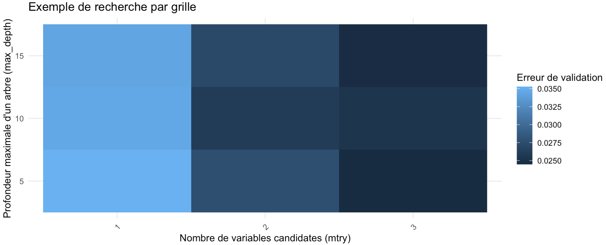
```

???

- Souvent, en apprentissage supervisé, on doit faire la calibration des hyperparamètres.
- Un hyperparamètre, c'est simplement un paramètre qui n'est pas entrainé (ou optimisé) directement par l'algorithme.
- Ces hyperparamètres doivent donc être optimisés par le modélisateur.
- Il existe plusieurs algorithmes pour faire la calibration des hyperparamètres, comme l'optimisation Bayesienne, mais une manière simple de faire (et souvent suffisante) est de se faire une grille et d'essayer toutes les combinaisons de cette grille. On choisit alors la combinaison menant à la meilleure performance sur des exemples hors-échantillon.
- Ici on a un exemple de recherche par grille pour un modèle de forêt aléatoire. Donc on a essayé 3 valeurs pour chacun des 2 hyperparamètres, et il semble que 3 variables candidates et un arbre de profondeur 5 ou 15 mène à la meilleure performance. 

---

# Introduction

## Apprentissage supervisé &#8212; Estimation de l'erreur de généralisation

- L'erreur calculée sur l'ensemble de validation (ou par validation croisée) **n**'est **pas** un bon estimé de l'erreur de généralisation.
  - En effet, lors du processus de calibration des hyperparamètres, il y a « **fuite d'information** » de l'ensemble de validation vers l'ensemble d'entrainement.
- Il est donc crucial de garder un ensemble test complètement indépendant.

```{r echo = F, out.width = "55%", fig.align = "center"}
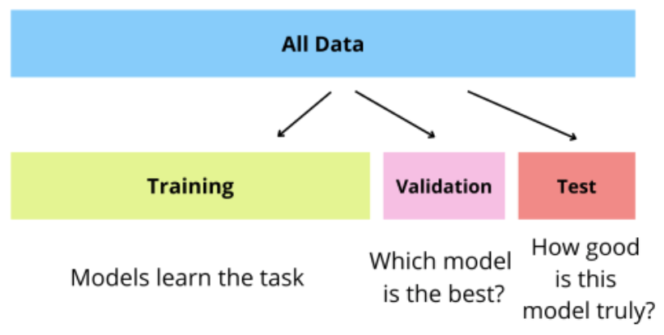
```

???

- Après voir calibré les hyperparamètres en entrainé notre modèle en utilisant les meilleurs hyperparamètres trouvés, on veut estimer sa performance de généralisation, c'est-à-dire la performance sur de toutes nouvelles données.
- La performance obtenues sur l'ensemble de validation ou par validation croisée n'est souvent pas une bonne estimation de la performance de généralisation.
- La raison est qu'il peut y avoir fuite d'information de l'ensemble de validation vers l'ensemble d'entrainement, ce qui va artificiellement augmenter la performance.
- Ça peut arriver par exemple si notre prétraitement (par exemple, centrer-réduire les prédicteurs) ne fait pas partie de notre pipeline de modélisation. Autrement dit, si on applique le prétraitement une seule fois sur le jeu de données au complet et qu'ensuite, on fait notre modélisation.
- Heureusement, des outils existent pour « greffer » un prétraitement des données au modèles. Par exemple, le pacakge « recipes » dans tidymodels ou bien les pipelines de sickit-learn en Python.
- Il y a aussi des manières plus subtiles de fuiter de l'information. Par exemple, le processus de calibration des hyperparamètres va presque systématiquement faire fuiter de l'information de l'ensemble de validation vers l'ensemble d'entrainement. Il y a en effet un genre de sélection artificielle des modèles qui se produit, et la performance de validation sera souvent gonflée (donc le modèle sera moins bon qu'on le pense).
- Il est donc recommandé, pour bien estimer la performance, de se garder un ensemble test qu'on utilise seulement qu'à la toute fin du processus, et seulement pour quelques modèles.

---

.vspace-neg2[]

# Introduction

## Données &#8212; Variables de tarification traditionnelles

.my-one-page-font[
| Nom                      | Description                                 | Type         |
|--------------------------|---------------------------------------------|--------------|
| `expo`                   | Durée du contrat                            | Numérique    |
| `annual_distance`        | Distance annuelle déclarée                  | Numérique    |
| `commute_distance`       | Distance au lieu de travail                 | Numérique    |
| `conv_count_3_yrs_minor` | Nombre de contraventions                    | Numérique    |
| `veh_age`                | Âge du véhicule                             | Numérique    |
| `years_claim_free`       | Nombre d'années sans réclamation            | Numérique    |
| `years_licensed`         | Nombre d'année depuis l'obtention du permis | Numérique    |
| `distance`               | Distance réelle parcourue                   | Numérique    |
| `gender`                 | Genre                                       | Catégorielle |
| `marital_status`         | Statut marital                              | Catégorielle |
| `pmt_plan`               | Plan de paiement                            | Catégorielle |
| `veh_use`                | Utilisation du véhicule                     | Catégorielle |
]

- Ainsi que le **nombre de réclamations** pour chaque contrat.

???

- Maintenant, je vous présente les données utilisées. Ce sont des données gracieusement fournies par Co-operators via la Chaire.
- Ça c'est les facteurs de risque traditionnels que j'utilise, incluant l'exposition au risque.
- Ce sont des données par contrat, et pour chaque contrat, on a l'information du nombre de réclamations faites durant la période de couverture.

---

# Introduction

## Données &#8212; Télématique

| Contract ID | Trip ID | Departure datetime | Arrival datetime | Distance | Maximum speed |
|:-----------:|:------:|:-----------------:|:----------------:|:--------:|:-------------:|
| A | 1 | 2017-05-02 19:04:15 | 2017-05-02 19:24:24 | 25.0 | 104 |
| A | 2 | 2017-05-02 21:31:29 | 2017-05-02 21:31:29 | 6.4 | 66 |
| $\vdots$ | $\vdots$ | $\vdots$ | $\vdots$ | $\vdots$ | $\vdots$ |
| A | 2320 | 2018-04-30 21:17:22 | 2018-04-30 21:18:44 | 0.2 | 27 |
| B | 1 | 2017-03-26 11:46:07 | 2017-03-26 11:53:29 | 1.5 | 76 |
| B | 2 | 2017-03-26 15:18:23 | 2017-03-26 15:51:46 | 35.1 | 119 |
| $\vdots$ | $\vdots$ | $\vdots$ | $\vdots$ | $\vdots$ | $\vdots$ |
<!-- | B | 1485 | 2018-03-23 20:07:08 | 2018-03-23 20:20:30 | 10.1 | 92 | -->
<!-- | C | 1 | 2017-11-20 08:14:34 | 2017-11-20 08:40:21 | 9.7 | 78 | -->
<!-- | $\vdots$ | $\vdots$ | $\vdots$ | $\vdots$ | $\vdots$ | $\vdots$ | -->

- 118 millions de trajets
- Période: 2015-2018

???

- J'ai aussi accès à des données télématiques sous la forme de résumés de trajets.
- Chaque trajet est décrit par 4 attributs, soit la date et heure de départ et d'arrivée, la distance parcourue et la vitesse maximale atteinte.
- Évidemment, ces trajets peuvent être liés à la base de données par contrat.

---

# Chapitre 1 - How Much Telematics...

## Motivations

- On sait que les données télématiques peuvent aider à mieux tarifer.
- Données volumineuses qui peuvent être difficile et coûteuses à stocker.
- De plus, peuvent être longues à processer.
- D'où la question « Quelle quantité d'information télématique a-t-on besoin? ».

???

- Ce qui nous amène au premier article, « How Much Telematics Information Do Insurers Need for Claim Classification? ».
- Donc la motivation pour cet article vient d'un inconvénient des données télématiques.
- Cet inconvénient, c'est que ce sont des données souvent très volumineuses.
- C'est donc difficile et coûteux à stocker, mais ce sont aussi des données qui coûtent cher en temps de calcul.
- On s'est donc posés la question à savoir quelle quantité d'information télématique est nécessaire pour avoir une bonne évaluation du risque.
- On tente de répondre à cette question sous l'angle de la classification supervisée.

---

# Chapitre 1 - How much telematics...

## Extraction de variables télématiques

```{r echo = F, out.width = "100%", fig.align = "center"}
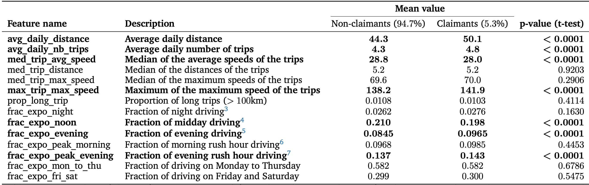
```

- Variables extraites à partir de la **date-heure** de **départ** et d'**arrivée**, de la **distance** et de la **vitesse maximale** de chaque trajet.

???

- On s'est tout d'abord créé des variables télématiques à partir des résumés de trajets. Donc les voici.
- Ce sont des variables qui, selon nous, pourraient être liées au risque de réclamer.
- Par exemple, on a la distance moyenne par jour et la proportion de conduite de nuit.

---

# Chapitre 1 - How much telematics...

## Performance des modèles

```{r echo = F, out.width = "100%", fig.align = "center"}
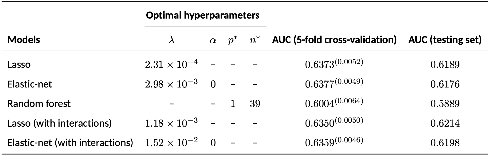
```

- Tous les modèles utilisent les **variables de tarification traditionnelle** + les **variables télématiques extraites**.
- Variable réponse: indicatrice d'une réclamation (0 ou 1).

???

- On a d'abord testé plusieurs modèles.
- Les GLM régularisés (donc le lasso et l'elastic-net) se sont avérés plus performants que la forêt aléatoire, ce qui suggère que la relation entre les prédicteurs et la réponse est plutôt linéaire.
- On a également testé le lasso et l'elastic-net avec toutes les interactions 2 à 2, ce qui n'a pas mené à un gain de performance, ce qui laisse penser encore une fois que la relation est plutôt linéaire.
- On choisit le lasso sans interactions, qui a la meilleure performance de validation croisée (à égalité avec l'elastic-net en fait, si on tient compte de l'écart-type entre parenthèses. On choisit le lasso puisqu'il mène à des modèles plus parcimonieux que l'elastic-net.).
- On a également estimé la performance de généralisation sur un ensemble test.

---

background-image: url(images/schema.png)
background-size: 70%
background-position: 95% 80%

.vspace-neg2[]
# Chapitre 1 - How much telematics...

## Jeux de données de classification

- Les k jeux de données <br> ont en commun les <br> variables de tarification <br> traditionnelles.
- Seule la quantité <br> d'information <br> télématique varie entre <br> les jeux de données.

???

- Donc avec notre modèle lasso en mains, voici comment on procède pour estimer la quantité de données télématiques nécessaire pour avoir une bonne estimation du risque.
- On se crée k jeux de données de classification. La différence entre les jeux de données est la quantité de données télématiques utilisée, qui va en augmentant de jeu de données en jeu de données.
- On va ensuite aller évaluer la performance de notre modèle de classification sur chaque jeu de données.

---

background-image: url(images/results_1.png)
background-size: 65%
background-position: 100% 80%

# Chapitre 1 - How much telematics...

## Résultats

- Expérience également faite avec <br> le nombre de mois de données <br> télématiques (résultats <br> non-montrés ici).
- Les données télématiques <br> deviennent redondantes <br> après environ **4000 km** ou <br> **3 mois**.

???

- Voici les résultats. Donc ici, chaque jeu de données a 1000km de données télématiques de plus que le précédent.
- On a utilisé du bootstrap pour obtenir une distribution de l'aire sous la courbe ROC pour chaque jeu de données.
- Il s'avère qu'après environ 4000km, la performance se stabilise. On a aussi le même graphique, mais où chaque jeu de données a un mois de données télématiques de plus que le précédent, et il se trouve que la performance se stabilise après environ 3 mois de données. 

---

# Chapitre 2 - Enhancing Claim Classification...
.vspace-neg2[]

## Introduction et motivations

.titre-bloc.bleu[
Hypothèse
]
.bloc.titre.bleu[
Le degré de routine et de péculiarité des trajets d'un assuré peut nous aider à estimer son risque.
]

.vspace-neg2[]
.pull-left[
**Routine**
___
Mesure à quel point le trajet d'un assuré est similaire (ou différent) par rapport aux autres trajets de .bleu-gras[cet assuré].
]

.pull-right[
**Péculiarité**
___
Mesure à quel point le trajet est similaire (ou différent) par rapport aux trajets des .bleu-gras[autres assurés].
]

.titre-bloc.rouge[
Aperçu
]
.bloc.titre.rouge[
- On calcule un **score** de **routine** et de **péculiarité** pour chaque trajet d'un assuré en utilisant des algorithmes de **détection d'anomalies**.
- On extrait ensuite des **covariables** à partir de ces scores.
]

???

- Ce qui nous amène au deuxième article « Enhancing Claim Classification with Feature Extraction From Anomaly-Detection-Derived Routine and Peculiarity Profiles ».
- Donc pour cet article, on a d'abord pensé que le degré de routine et/ou de péculiarité d'un conducteur assuré peut aider à mieux estimer son risque.

- Le degré de routine, ça répond vraiment à la question « Est-ce que le conducteur fait des trajets qui sont plutôt homogènes, ou plutôt hétérogènes? ». Donc un conducteur qui fait toujours les mêmes trajets aux mêmes heures est considéré routinier. Ça peut se calculer pour chaque conducteur de manière isolée des autres conducteurs.
- Le degré de péculiarité, ça répond plutôt à la question « Est-ce que le conducteur fait des trajets qui sont plutôt semblables aux trajets des autres conducteurs, ou plutôt similaires? ». Donc un conducteur qui fait souvent des trajets de 200km pendant la nuit serait probablement considéré péculier.

- Donc en résumé, dans cet article, on calcule un score de routine et un score de péculiarité pour chaque trajet en utilisant des algorithmes de détection d'anomalies non-supervisés.
- On extrait ensuite des variables à partir de ces scores, qu'on utilise dans des modèles de classification.

---

background-image: url(images/flowchart_2.png)
background-size: 85%
background-position: 100% 250%

# Chapitre 2 - Enhancing Claim Classification...

## Aperçu

???

- Voici un aperçu du projet.
- On a notre jeu de données télématiques ici, sur lequel on applique un algorithme de détection d'anomalies pour dériver un profil de routine et de péculiarité pour chaque conducteur.
- On va ensuite résumer ces profils, ce qui va constituer des variables qu'on pourra utiliser pour augmenter le jeu de données avec les variables traditionnelles.

---

# Chapitre 2 - Enhancing Claim Classification...

## Algorithmes de détection d'anomalies

.panelset.sideways[
.panel[.panel-name[Méthode de Mahalanobis]
```{r echo = F, out.width = "100%", fig.align = "center"}
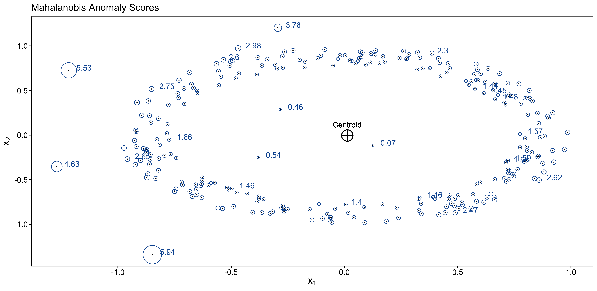
```

]
.panel[.panel-name[Local Outlier Factor]
```{r echo = F, out.width = "100%", fig.align = "center"}
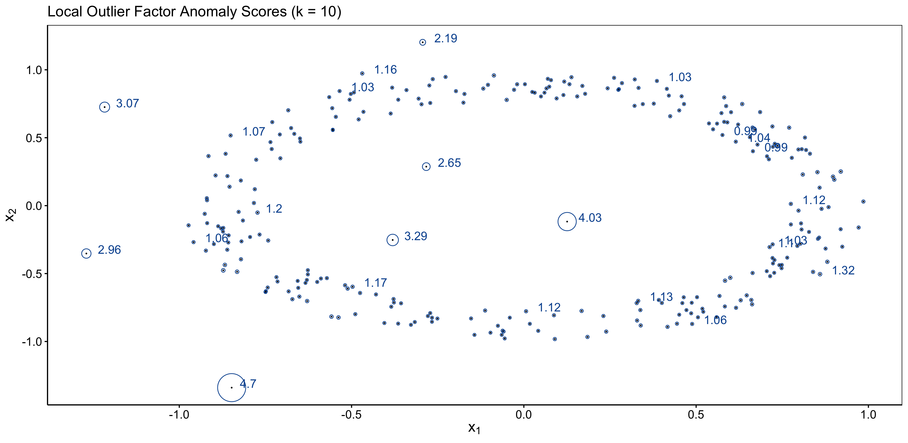
```
]

.panel[.panel-name[Isolation Forest]
```{r echo = F, out.width = "100%", fig.align = "center"}
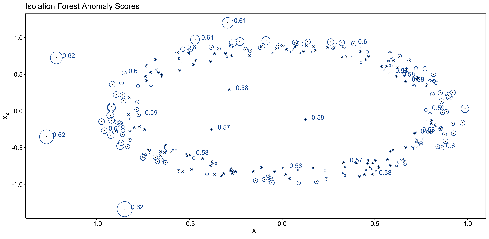
```
]
]

???

- On a testé 3 algorithmes de détection d'anomalies.
- Ce sont des algorithmes non-supervisés, donc qui utilisent seulement la matrice de design x. Ils n'utilisent pas la variable réponse y.
- Le but de ces algorithmes est d'assigner un score d'anomalie à chaque point du nuage de points. Plus le point est considéré anormal, plus son score est élevé.
- Dans ce projet, chaque trajet peut être considéré comme un point dans un nuage de points.
- C'est vraiment intéressant de savoir comment ces algorithmes là calculent les scores d'anomalies, mais je vais passer rapidement là-dessus.
- Une chose intéressante à remarquer est que le Local Outlier Factor est différent des 2 autres puisqu'il va aussi détecter les anomalies locales, et non seulement les anomalies globales.
- Les anomalies globales se retrouvent seulement au bord du nuage de points, tandis que les anomalies locales peuvent aussi être en plein milieu, mais à des endroits où il n'y a pas beaucoup de points.

---

# Chapitre 2 - Enhancing Claim Classification...

## Attributs utilisés pour la détection d'anomalies

- Chaque trajet est caractérisé par 4 données: **date-heure d'arrivée**, **date-heure de départ**, **distance** et **vitesse maximale**.
- On dérive **8 attributs** à partir de ces données: 

```{r echo = F, out.width = "100%", fig.align = "center"}
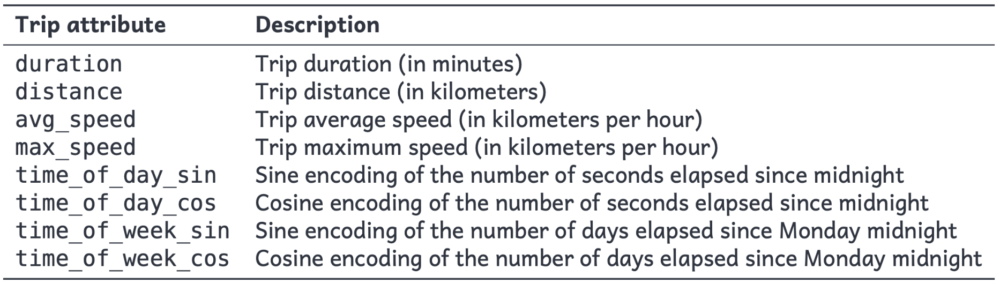
```

- Les algorithmes de détection d'anomalies seront appliqués sur ce nuage de points en 8 dimensions.

???

- Ici, on a les 8 variables sur lesquelles on applique la détection d'anomalies.
- Pour les variables de l'heure de la journée et du temps de la semaine, on a fait un encodage sinus-cosinus pusique ce sont des varaibles cycliques.

---

```{r xaringan-panelset, echo = F}
xaringanExtra::use_panelset()
```

```{r echo=FALSE}
xaringanExtra::style_panelset_tabs(
  active_foreground = "#0051BA",
  hover_foreground = "#d22",
  font_family = "Roboto"
)
```

# Chapitre 2 - Enhancing Claim Classification...

## Calcul des scores de routine et de péculiarité

.panelset.sideways[
.panel[.panel-name[Routine]
```{r echo = F, out.width = "80%", fig.align = "center"}
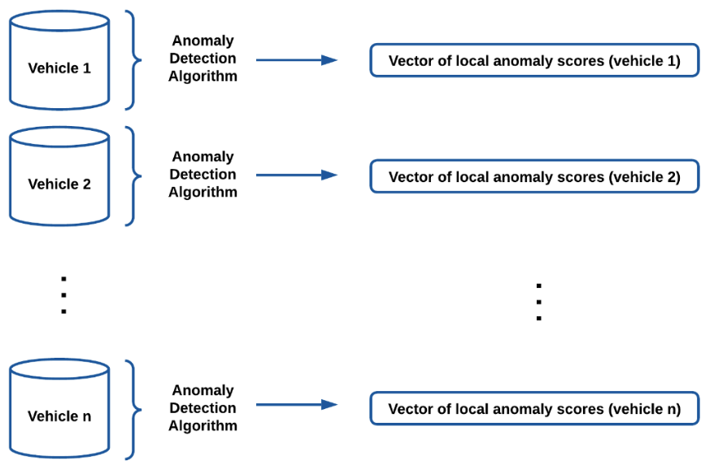
```

]
.panel[.panel-name[Péculiarité]
```{r echo = F, out.width = "80%", fig.align = "center"}
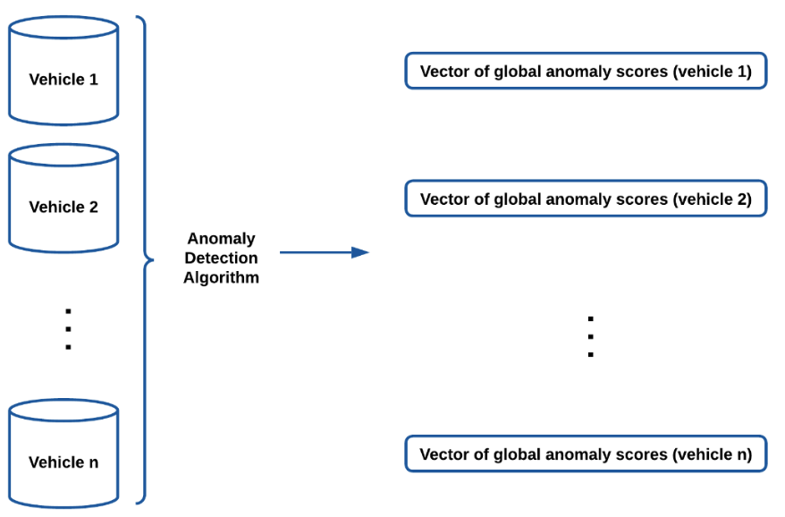
```
]
]

???

- Donc pour calculer les scores de routine et de péculiarité, c'est simple, on applique la détection d'anomalies sur les trajets.
- La différence entre les 2, c'est que pour la routine, la détection d'anomalies est appliquée sur chaque conducteur (ou véhicule) en isolation. Pour la péculiarité, la détection d'anomalies est faite sur tous les trajets en même temps.
- Donc ici, le trajet va se voir assigner un haut score d'anomalie s'il est anormal par rapport aux autres trajets de ce véhicule.
- Tandis qu'ici, il va se voir assigner un haut score s'il est différent par rapport à tous les autres trajets du jeu de données.

---

# Chapitre 2 - Enhancing Claim Classification...

**A-t-on réussi à discriminer .bleu-gras[routiniers] et .bleu-gras[non-routiniers]?**

.panelset.sideways[
.panel[.panel-name[Un conducteur routinier] 
```{r, echo=F, out.width="100%"}
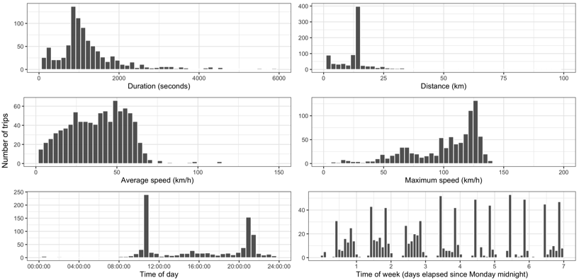
```
]
.panel[.panel-name[Un conducteur non-routinier]
```{r, echo=F, out.width="100%"}
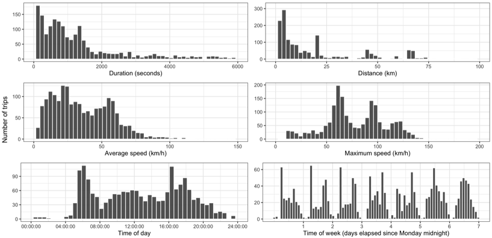
```
]
]

---

# Chapitre 2 - Enhancing Claim Classification...

**A-t-on réussi à discriminer routiniers et non-routiniers?**

```{r, echo=F, out.width="100%"}
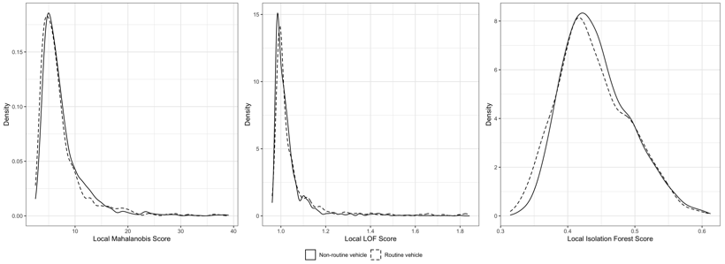
```

---

# Chapitre 2 - Enhancing Claim Classification...

**A-t-on réussi à discriminer .bleu-gras[péculiers] et .bleu-gras[non-péculiers]?**

.panelset[
.panel[.panel-name[Un conducteur péculier]
```{r}
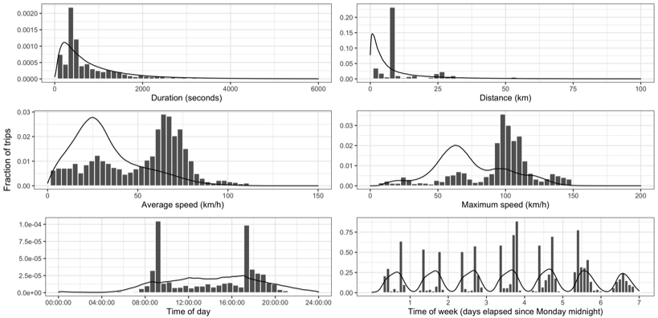
```

]
.panel[.panel-name[Un conducteur non-péculier]
asdf2
]
]

---

# Chapitre 2 - Enhancing Claim Classification...

- TRF: les 10 variables de tarification traditionelles.
- Le tableau montre l'.bleu-gras[amélioration] par rapport au .bleu-gras[modèle de base].

```{r echo = F, out.width = "100%", fig.align = "center"}
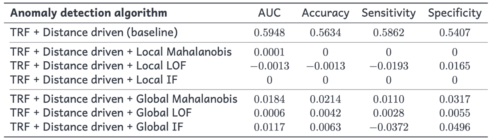
```

**Modèle utilisé**: régression logistique avec pénalité elastic-net.

???

- 

---

# Chapitre 3 - Telematics Combined Actuarial...

## Introduction et motivations
.vspace-neg2[]

.left-column[
```{r echo = F, out.width = "60%", fig.align = "center"}

```

```{r echo = F, out.width = "65%", fig.align = "center"}

```

```{r echo = F, out.width = "60%", fig.align = "center"}
knitr::include_graphics("images/nn_icon.png")
```
]

.right-column[
<br>
<br>
<br>
.ecriture-grise[Depuis plusieurs années, les assureurs utilisent les informations télématiques dans leurs modèles de tarification.]
<br>
<br>
<br>
.ecriture-grise[La plupart du temps, le jugement humain est utilisé pour en extraire des variables de tarification.]
<br>
<br>
<br>
.ecriture-grise[Et si on automatisait cette extraction à l'aide d'un réseau neuronal?]
]

???

- Insurers have been leveraging telematics data in their pricing models for several years now.
- Using telematics data in pricing model has many benefits:
  - More precise pure premium
  - Incentive for safer and less frequent driving (less accidents, congestion and pollution)
  - Substitute to sensible rating factors
  - Etc.
- Insurers will most of the time take the raw telematics data and try to extract features from it that they think are correlated with the claiming risk:
  - harsh acceleration/braking
  - % night driving
  - % driving in different speed buckets
  - Etc.
- This is a good approach, but it heavily relies on human judgement, with its flaws and biases.
- For instance, how do we define "night driving" or "harsh braking"?
- An alternative approach is to let the data speak more freely by training a model that automatically learns useful features from raw data.
- This is what we do in this project, by training a neural network directly on raw telematics data, wih minimal human intervention.
- Indeed, NNs are known for being good at extracting features from minimally processed data.
- More specifically, we consider a special architecture called "Combined Actuarial Neural Network", which we compare with a benchmark that uses handcrafted telematics features.

---

# Chapitre 3 - Telematics Combined Actuarial...
<div class="neg-break"></div>
## Approche « Combined Actuarial Neural Network » (CANN)
<div class="neg-break"></div>
.pull-left[
```{r echo = F, out.width = "90%", fig.align = "center"}
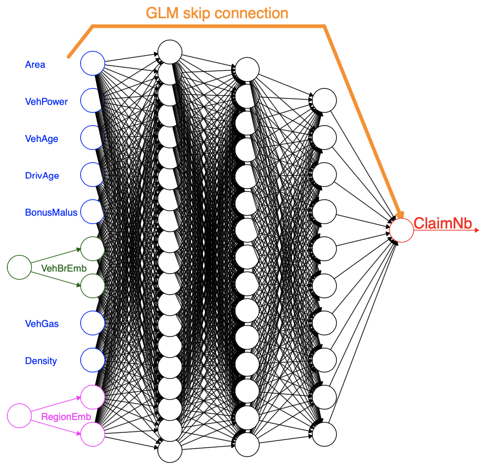
```

.center[Développée par M. Wüthrich et M. Merz dans [cet article](https://papers.ssrn.com/sol3/Delivery.cfm/SSRN_ID3320525_code769240.pdf?abstractid=3320525)
]].
</br>
</br>
</br>
.ecriture-grise[Il s'agit d'un .bleu-gras[modèle paramétrique classique] (souvent un GLM) auquel un .bleu-gras[réseau neuronal] a été « attaché ».]

.ecriture-grise[L'objectif de la partie réseau neuronal est de .bleu-gras[capturer] tout .bleu-gras[signal] qui aurait pu être manqué par le GLM.]

.ecriture-grise[Les paramètres de la partie GLM sont généralement initialisés au .bleu-gras[maximum de vraisemblance], tandis que ceux de la partie réseau neuronal sont initialisés à .bleu-gras[zéro].]

???

- Here is the generic neural network (NN) architecture we use to model the number of claims.
- Developed by Mario V. Wüthrich and Michael Merz, it is called the "Combined Actuarial Neural Network" or CANN for short.
- CANN is a two-part neural network consisting of the GLM part and the network part.
- The GLM part functions like a regular GLM, while the network attached to it aims to capture signals that may have been missed by the GLM.
- A GLM is limited in its ability to capture interactions between predictors and can only approximate linear functions of predictors. The network part helps improve performance by complementing the GLM.
- Typically, the parameters of the GLM part are initialized using maximum likelihood, while the parameters of the network part are initialized at zero.
- This initialization allows the entire neural network to provide decent predictions from the start. During training, the network part is trained on the residuals of the GLM, which can be seen as a neural network boosting of the GLM
- The CANN architecture offers several advantages:
  - The GLM part allows for better interpretability.
  - CANN starts with decent predictions from the GLM, resulting in faster training.
  - It is a flexible approach. In this example, both parts are fed with the same inputs, but the network part can also accommodate other types of inputs. Neural networks are known to be effective with unstructured data such as telematics data and text data.
- Another interesting aspect of this approach is that it can be used for feature extraction, with the extracted features then used in a separate GLM. This would allow to leverage the strengths of both neural networks and GLMs: neural networks for complex function approximation and GLMs for their desirable properties.
- Additionally, the features created in the hidden layers can be visualized using dimensionality reduction techniques, potentially providing insights into telematics data.
- In summary, this architecture could be valuable in various supervised learning problems, particularly when dealing with unstructured data.
- In fact, the project consists of training this architecture with telematics information incorporated into the network part. To accomplish this, we consider three popular distribution specifications for count data: Poisson and negative binomial for cross-sectional data, and the Multivariate Negative Binomial for longitudinal data.

---

# Chapitre 3 - Telematics Combined Actuarial...
<div style="margin-top: -30px;"></div>

## Données télématiques en entrée au réseau

<div style="margin-top: -10px;"></div>
.ecriture-grise-petite[On veut que le réseau apprenne à partir des données brutes, mais on a besoin d'un prétraitement minimal:]

.bloc.bleu[
$\boldsymbol{h} = (h_1, h_2, \dots, h_{24})$ où $h_i$ est la fraction de conduite au cours de la $i^\text{e}$ heure de la journée.

$\boldsymbol{p} = (p_1, p_2, \dots, p_7)$ où $p_i$ est la fraction de conduite au cours du $i^\text{e}$ jour de la semaine.

$\boldsymbol{vmo} = (vmo_1, vmo_2, \dots, vmo_{14})$ où $vmo_i$ est la fraction des trajets dans le $i^\text{e}$ intervalle de vitesse moyenne.

$\boldsymbol{vma} = (vma_1, vma_2, \dots, vma_{16})$ où $vmo_i$ est la fraction des trajets dans le $i^\text{e}$ intervalle de vitesse maximale.

$\boldsymbol{d} = (d_1, d_2, \dots, d_{10})$ où $d_i$ est la fraction des trajets dans le $i^\text{e}$ intervalle de distance.
]

.ecriture-grise-petite[On .bleu-gras[concatène] ensuite ces quatre vecteurs en un grand vecteur d'entrée de dimension 24 + 7 + 14 + 16 + 10 = 71, qui servira d'entrée à la partie MLP du modèle CANN :]

$\textbf{vecteur_telematique} = (\boldsymbol{h}, \boldsymbol{p}, \boldsymbol{vmo}, \boldsymbol{vma}, \boldsymbol{d})$

???

- From this telematics dataset, we therefore create 4 telematics vectors.
- The first one, h, is of dimension 24 (for the 24 hours of the day), and each elements is the fraction of driving in the correponding hour of the day. For instance, $h_1$ is the fraction of driving for a given contract made between midnight and 1:00.
- The second one is similar, but instead records the fraction of driving in each day of the week.
- vmo records the fraction of trips made in different buckets of average speed. I made 10 kilometers per hour buckets, so for instance, vmo_1 is the fraction of trips made at an average speed between 0 and 10 kph. 
- vma is the same, but for maximum speed. 
- We then concatenate these 4 vectors into 1 big telematics vector, which summarises the driving habits of a given contract.
- These telematics inputs are represented by green circles.

---

# Chapitre 3 - Telematics Combined Actuarial...

---

# Conclusion


